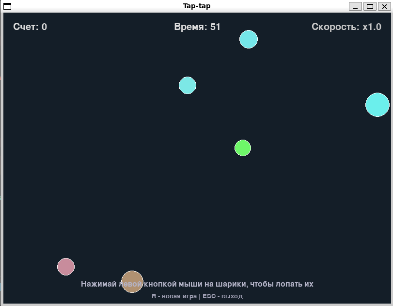

# Tap-tap

Простая аркадная игра на Pygame Zero: на экране летают разноцветные шарики, задача — лопать их кликом мыши и набрать как можно больше очков за 60 секунд. Чем больше очков, тем быстрее становятся шарики.



## Правила

- Кликай левой кнопкой мыши по шарику, чтобы лопнуть его и получить очко.
- Скорость шариков растёт по мере роста счёта.
- У игры есть таймер на 60 секунд — по истечении времени показывается финальный счёт.
- `R` — начать новую игру.
- `ESC` — выйти из игры.

## Чему научилась / что использовано

- Основы ООП: логика игры разделена на классы `Circle` и `Game`, каждый со своей ответственностью.
- Библиотека [Pygame Zero](https://pygame-zero.readthedocs.io/) — обработка событий мыши/клавиатуры, отрисовка, звук.
- Движение и анимация с использованием `dt` (времени между кадрами), чтобы игра работала одинаково независимо от частоты кадров.
- Работа со звуком в pygame/pgzero, включая решение проблем с инициализацией аудио.

## Установка и запуск

### Требования

- Python 3.10+
- Установленные зависимости из `requirements.txt`

### Windows

```bash
python -m venv .venv
.venv\Scripts\activate
pip install -r requirements.txt
python main.py
```

### Linux / WSL

```bash
python3 -m venv .venv
source .venv/bin/activate
pip install -r requirements.txt
python main.py
```

> Если запускаешь игру в WSL и звук не работает, убедись, что WSLg настроен и звуковое устройство доступно (`speaker-test` должен воспроизводить тестовый сигнал).

## Структура проекта

```
Tap-tap/
├── main.py           # весь код игры
├── sounds/           # звуковые эффекты
├── screenshots/      # скриншоты для README
├── requirements.txt  # зависимости проекта
└── README.md
```
